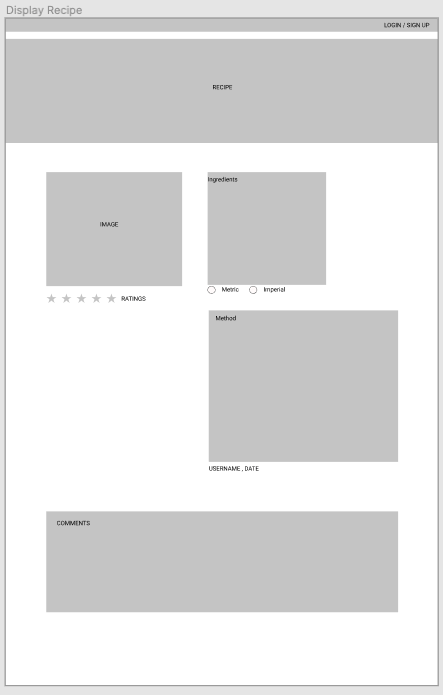

# R1 | Website Description
### Purpose
To build an instagram/taste like resource purely for sustainable living products where users can add and search ‘recipes’ for; skincare, cleaning products, perfume, diffusers etc. The purpose of building such a website is so that consumers can reduce their environmental footprint by limiting the amount of packaging bought from everyday products while targeting a zero waste lifestyle. 
 
### Functionality 
+ Roles of users and admin
+ Users can view recipes without logging in
+ Users can comment on recipes
+ Users can rate the recipes
+ To add recipes, comment etc users must create an account and login
+ Search for particular recipes
+ Upload photos with their recipes
+ Admin can delete any comments 
+ Admin can delete any recipes
+ Users can delete their own recipe
+ Users can delete their own comment
+ List of words inbuilt that cannot be contained within a recipe or comment
+ Weight conversion button

### Target Audience
Anyone looking for ways to reduce their environmental footprint at home

#### Tech stack

+ Mongo db (NoSQL Database)
+ Mongoose
+ Express
+ React
+ Nodejs (Server)
+ JavaScript
+ Passport (Authentication)
+ Express (Authorisation)
+ Bootstrap and Styled Components (Styling)
+ Mocha and Supertest (Back end Testing)
+ Jest and Enzyme (Front End Testing)
+ Axios
+ Netlify 
+ Heroku

#### Project Planning
+ Figma - to create Wireframes
+ Trello Board - Project Planning Tool
+ Lucid Chart - Data Flow Diagram, Application Architecture Diagram, ERD
+ Google Drive - to compile docs and put together Readme

# R2 | Data Flow Diagram
[Data Flow Diagram](https://app.lucidchart.com/documents/edit/453bd56e-3f76-49d3-955f-e67b0e84a36a/0_0?beaconFlowId=CBC8785147198093)
  

# R3 | Application Architecture Diagram
[Application Architecture Diagram](https://app.lucidchart.com/invitations/accept/3388646d-58c8-4b0d-95d7-0e8880ce11fc)
  

# R4 | User Stories
+ As a logged in user, I want to be able to create a recipe, so that I can share the recipe with other who might be interested.

+ As a user, I want to be able to view all recipes, so that I can check out the recipes.

+ As a logged in user, I want to be able to comment and rate the recipe, so that I can give the recipe the feedback

+ As a user, I want to be able to search a recipe by category, ingredient, product, so that I can find out the specific recipe.

+ As a user, I want to be able to create a profile and add an image

+ As a logged in user, I want to be able to upload the picture with the recipe, so that I can show the look of the completed product of the recipe.

+ As an admin, I want to be able to delete any recipe and any comments, so that I can make sure the recipes and the comments are all relevant to the website.

+ As a user, I want to be able to edit my recipe so that I can delete or update my recipe.

+ As a user, I want to be able to convert measurement type so that I can measure with the entity(unit) that I am used to.

# R5 | Wireframes

Wireframes were created for all pages and all page sizes. A selection have been displayed below with the remainder available in the link.

### Mobile
[View all Mobile Wireframes](https://www.figma.com/file/kN7K2YGSeGk1oRk8dL2ZOL/Sustainable_Living?node-id=31%3A10)

###### Sign Up
  

###### Welcome 
  

###### All Recipes within Category
  

### Tablet
[View all Tablet Wireframes](https://www.figma.com/file/kN7K2YGSeGk1oRk8dL2ZOL/Sustainable_Living?node-id=29%3A19)

###### Create A New Recipe
  

###### Display Single Recipe
  

###### User's Recipes
  

### Desktop 
[View all Desktop Wireframes](https://www.figma.com/file/kN7K2YGSeGk1oRk8dL2ZOL/Sustainable_Living?node-id=0%3A1)

###### Login
  

###### Display Single Recipe
  

###### All Recipes within Category
  

# R6 | Trello Board Screenshots
[Trello Board](https://trello.com/b/3fE4Zkf8/zero-waste-diy-recipe-book)

#### Day 1

#### Day 2

#### Day 3

#### Day 4

#### Day 5

